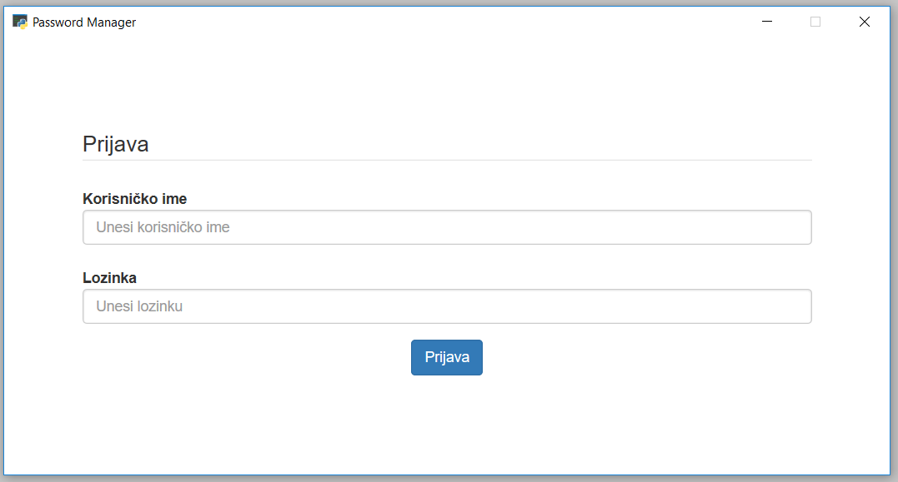
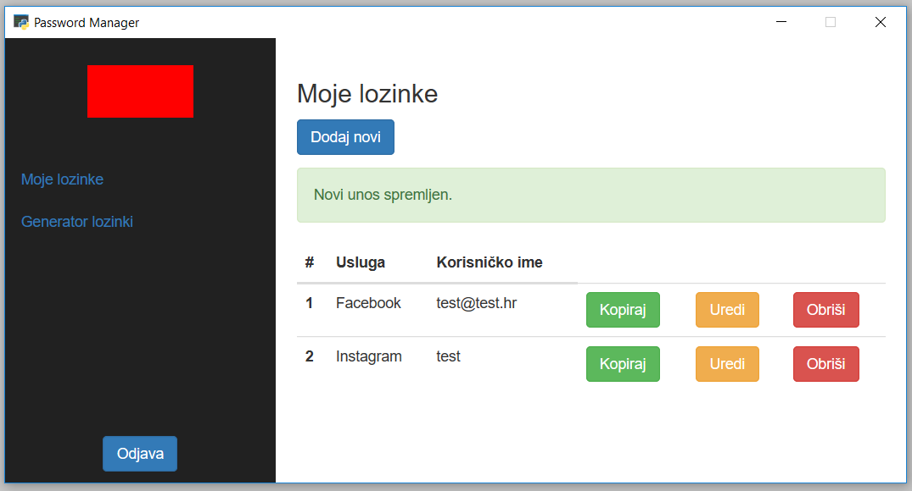

# Password Manager
Desktop password management tool made with Python and Flask micro-framework. *Software is in Croatian.*

> Only the paranoid survive.

## Features

 - Can be built as a one file .exe with Pyinstaller (*todo: problems with building*)
 - Completely offline
 - AES256 encryption
 - Database saved in Documents for easy backup
 - Password removed from clipboard after 15 seconds
 - Password generator for generating new passwords

## TODO

- Logo design
- SSL
- TAN numbers authentication
- Two factor authentication when PC changes
- Remove Crypto dependency
- Code optimizations, fix build problems
- (....)

